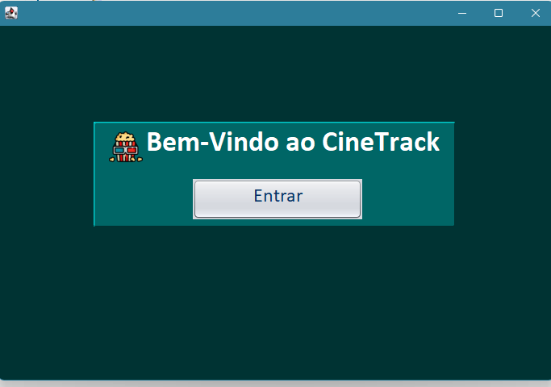
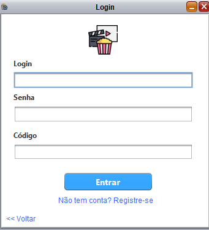
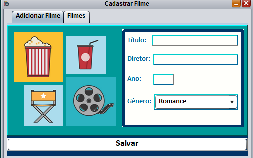
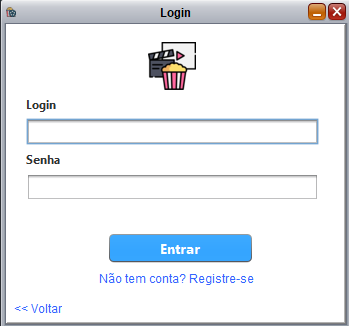

# 🎬 CineTrack

O CineTrack é uma aplicação de desktop desenvolvida em Java com Swing para catalogar, gerenciar e avaliar filmes.

## ✨ Funcionalidades

* **Autenticação de Usuário**: Sistema de login e cadastro seguro para clientes e administradores.
* **Gerenciamento de Filmes**: Administradores podem adicionar, editar e remover filmes do catálogo.
* **Gerenciamento de Usuários**: Acesso administrativo para visualizar, editar e remover usuários do tipo cliente.
* **Avaliação de Filmes**: Clientes podem atribuir notas e escrever comentários para os filmes.
* **Geração de Relatórios**: Administradores podem gerar relatórios com a lista completa de filmes cadastrados.
* **Interface Gráfica Intuitiva**: Interface amigável construída com Swing para uma fácil navegação.

## 🛠️ Tecnologias Utilizadas

* **Linguagem**: Java 24
* **Interface Gráfica**: Swing
* **Banco de Dados**: MySQL

## ⚙️ Pré-requisitos

Antes de começar, garanta que você tenha os seguintes softwares instalados:

* JDK (Java Development Kit) - Versão 24 ou superior.
* MySQL Server
* Driver JDBC para MySQL (o projeto foi configurado com `mysql-connector-j-9.3.0.jar`).

## 🚀 Como Executar

1.  **Clone o repositório:**
    ```bash
    git clone [https://github.com/laisvarela/cinetrack.git](https://github.com/laisvarela/cinetrack.git)
    ```
2.  **Configure o Banco de Dados:**
    * Acesse o seu servidor MySQL.
    * Crie um novo usuário com as seguintes credenciais (ou altere o arquivo `src/dao/ConexaoDAO.java` com as suas):
        * **Usuário**: `Seu nome aqui`
        * **Senha**: `Sua senha`
    * A aplicação irá criar o banco de dados `cinetrack` e as tabelas (`usuarios`, `filmes`, `avaliacoes`) automaticamente na primeira execução.

3.  **Execute a Aplicação:**
    * Importe o projeto na sua IDE de preferência (NetBeans, Eclipse, IntelliJ, etc.).
    * Execute a classe principal `view.TelaPrincipal.java`.

## 🖼️ Telas da Aplicação

<p align="center">
  <i>Images das Telas</i>
  <br>
  <strong>Tela Principal</strong><br>
  
  <br><br>
  <strong>Tela de Login (Admin)</strong><br>
  
  <strong>Tela de Cadastrar Filme (Admin)</strong><br>
  
  <strong>Tela de Login (Clientes)</strong><br>
  
</p>

## 👩‍💻 Autores

* **JaoGoncalves**
* **laisvarela**
